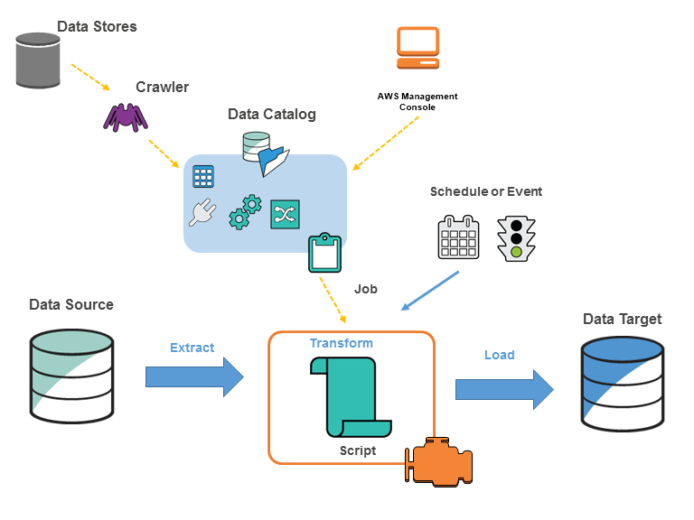

# AWS Glue Overview

> Jay Kumsi & Sravya Arutla
## What is ETL?
Extract, Transform, and Load (ETL) is a data integration process consisting of three primary steps:

* Extracting: This involves pulling data from various homogeneous or heterogeneous sources and transferring it to a staging area where it can be processed.
* Transforming: This step includes performing operations such as cleaning, organizing, validating, and applying business rules to the data. Additional processes like mapping and reformatting are also conducted. The goal is to refine the data to make it suitable and optimized for downstream uses such as data analytics, machine learning, etc.
* Loading: Finally, the transformed data is loaded into a target destination, which could be a database, data warehouse, or data mart, where it is ready for analytics and business intelligence activities.
  
   

    
  

* ETL Job : An ETL job is a process where data is taken from different sources, cleaned and organized to fit business needs, and then stored in a new place where it can be easily accessed and analyzed.

## Introduction
- Serverless data integration service.
- Fully managed Extract, Transform, and Load (ETL) service.
- Simplifies data preparation and processing for analytics and machine learning.
- Automates data discovery, cataloging, cleaning, enriching, and transferring.
- Allows users to focus more on data analysis and less on infrastructure management.
- Supports data movement between various data stores.
- Runs on the Apache Spark Engine

  

***Fig.1 AWS Glue Components***
Below are the listed Key AWS Glue Components.

## AWS Glue Components
AWS Glue utilizes a collaborative framework of multiple components, each contributing to the design and upkeep of ETL processes.

### Glue Console
- Enables the creation, monitoring, and management of ETL jobs by users for orchestrating the ETL workflows.

### Glue Data Catalog

- Central Metadata Repository: Stores information on data assets, accessible regardless of their physical location.
- Unified Metadata Store: Serves as a single source for all data sources and targets, enhancing data management and accessibility.
- Seamless Data Discovery: Simplifies the process of discovering data across various datasets.
- Efficient ETL Processes: Enables smooth Extract, Transform, and Load operations, ensuring data is readily prepared for analysis.
- Optimized Query Execution: Facilitates efficient query execution across datasets, improving data retrieval and analysis.

### Crawler and Classifier
* Crawler: A component of AWS Glue that scans various data stores to automatically discover and infer schemas. It categorizes data formats and suggests schemas and transformations, populating the Glue Data Catalog with table definitions.

* Classifier: Identifies the schema of data. Upon execution, a crawler activates classifiers to deduce the data's format and schema. These classifiers are adept at recognizing a range of file formats and data types, such as JSON, CSV, and Parquet.

### Database
Databases in the AWS Glue Data Catalog function as collections of related Data Catalog table definitions, systematically organized into logical groups. This structure supports efficient data catalog organization and streamlines the control of access and permissions across a variety of datasets.

### Data Store, Data Source, and Data Target
- Data Store: A repository designated for data storage. Within AWS Glue, data stores encompass Amazon S3 buckets, Amazon RDS databases, Amazon DynamoDB tables, among others.
- Data Source: The origin point from which an ETL job retrieves its data. This encompasses any data store that is accessible by AWS Glue.
- Data Target: The endpoint to which an ETL job delivers the processed data. Similar to the data source, it includes any data store supported by AWS Glue.

### Table
- Provides a metadata definition, capturing the schema of data in its original storage location.
- Includes details like column names, data types, and additional attributes, reflecting the structure of tables in standard relational databases. 

Therefore, AWS Glue tables establish a structured metadata framework, outlining the characteristics of the data without changing its actual form or position.

### Job
- A business logic that automates the ETL process.
- Involves extracting data from a source, transforming this data according to specified rules, and loading it into a target destination.

### Glue Triggers
- Conditions or schedules that automatically start ETL jobs.
- Configurable to activate on a set schedule, in reaction to specific events, or on-demand, facilitating flexible and automated management of data workflows.

### Development Endpoint
- A development endpoint provides an environment for the interactive development and testing of ETL scripts.
- It offers a serverless Apache Spark environment, enabling exploration and experimentation with data transformation logic prior to deployment as a job.

Each of these components plays a crucial role in the AWS Glue service, working together to provide a comprehensive and scalable solution for data integration and ETL processes across a wide range of data sources and formats.

## AWS Glues Pros and Cons

### Pros

- Serverless maintenance and deployment
- Automatic ETL code generation
- Cost-effective usage billing
- Simplified job scheduling
- Enhanced data visibility
- Broad AWS service integration

### Cons

- AWS-only integration
- SQL-only query support
- No built-in testing environment
- Spark, Scala, and Python expertise required
- No real-time data operations

## AWS Glue Features
1. Serverless ETL Service: AWS Glue is serverless, which means it automatically provisions the environment needed to complete the job without requiring you to manage any infrastructure.

2. Data Catalog: AWS Glue provides a persistent metadata repository known as the AWS Glue Data Catalog, which stores metadata about your data assets, making it easy for you to find and access data across AWS services.

3. Integrated Data Sources: It supports data stored in Amazon S3, Amazon RDS, Amazon Redshift, and any JDBC-compliant databases. This broad support enables seamless integration with a variety of AWS and on-premise data stores.

4. Automatic Schema Discovery: AWS Glue automatically discovers and profiles your data via its crawlers, suggesting schemas and transformations, which reduces the manual effort typically involved in preparing data for ETL.

5. Code Generation: AWS Glue generates ETL code in Python or Scala that is customizable and reusable. It simplifies the process of writing ETL scripts by generating code that's tailored to your data sources.

6. Flexible Scheduling: ETL jobs in AWS Glue can be triggered based on a schedule, in response to events, or on-demand. This allows for flexible data processing workflows that can adapt to business needs.

7. Scalable and Efficient: AWS Glue can handle ETL workloads that scale from a few data processing units (DPUs) to potentially thousands, automatically scaling to match the workload. DPUs are a measure of processing power that encapsulate CPU, memory, and network capacity.

8. Transformations and Job Orchestration: Glue offers built-in transformations, and it also integrates with AWS Step Functions to allow for complex job orchestration workflows across multiple AWS services.

## AWS Glue Work Flow

1. Data Stores:

   * Contains raw data stored across various systems (like databases or cloud storage).
2. Crawler:

  * Automatically scans the data in these stores.
  * Identifies the format, schema, and associated properties of the data.
  * Updates the AWS Glue Data Catalog with this metadata.
3. Data Catalog:
  
  * Central repository for all data metadata collected by the crawler.
  * Helps in managing and accessing data structure information easily.
3. AWS Management Console:

  * Interface used to configure and manage AWS Glue settings and operations.
4. Schedule or Event:

  * Triggers for the AWS Glue jobs which can be set based on specific schedules (time-based) or events (like data updates).
5. Job:

  * Consists of business logic that performs ETL operations:
  * Extract: Data is extracted from the source systems listed in the Data Catalog.
  * Transform: Data is processed and transformed using predefined scripts to clean, reformat, and enrich.
  * Load: Transformed data is loaded into a target system for further analysis like a data warehouse or data mart.
6. Data Source and Data Target:

  * Data Source: The initial repository from where data is pulled during the extract phase.
  * Data Target: The final destination where cleaned and transformed data is stored for access and analysis.

## Use Cases

- Integration with Amazon Athena
- Integration with Amazon S3
- Integration with Snowflake
- Integration with GitHub
- Creating an event-driven ETL pipeline: with AWS Lambda, you can trigger an ETL job when new data is added to Amazon S3.
