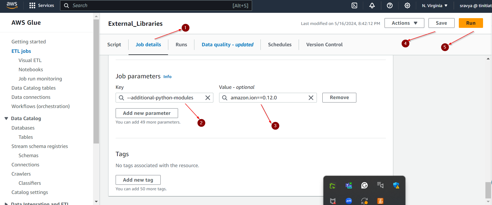

# Installing Python Libraries and python modules in AWS Glue Environment.

AWS Glue allows customization of the Python environment for ETL jobs through specific parameters, facilitating the inclusion of additional Python libraries and custom Python files.

## Method 1: Including Additional Python Modules (--additional-python-modules)
This parameter lets users specify external Python libraries that are not present in the default Glue environment, enabling installation via pip.

### Usage:
Configure this in the AWS Management Console, CLI, or SDKs by adding it to the job’s settings. AWS Glue installs these libraries at runtime before the script execution.

### Example 
Adding the amazon.ion library to execute the script [write-to-json](../glue-code/ti-pyspark-write-to-json.py)
To integrate the amazon.ion library into your AWS Glue job, configure the job parameters as shown below:
```
--additional-python-modules "amazon.ion==0.5.0"
```
Glue Configuration for this is as below.

1. Navigate to the Job Details page in the AWS Glue console.
2. Go to Advanced Details and In the job parameters section, add --additional-python-modules "amazon.ion==0.5.0".
3. Save the changes to the job configuration.
4. Execute the job. During runtime, the specified amazon.ion library will be automatically imported and ready to use.
5. Below is an example screenshot illustrating where to enter the library details:

   

## Method 2: Utilizing Custom Python Files (--extra-py-files)

This method involves including custom Python scripts or dependencies stored in S3, packaged as .zip or .egg files. For sample custom package, we are importing pdf_genrator custom package as mentioned below steps.

### Step 1: Prepare your Python files: Develop your custom Python scripts.
Let's create a custom Python package that generates a PDF with sample data and then package it for use in an AWS Glue script. We'll use the ReportLab library, which is great for generating PDFs in Python.

Steps to create custom package for writing sample data into PDF file are as below.

1. Install ReportLab locally using pip through command line
   ```python
    pip install reportlab
   ```
2. Write a Python Script to [Generate a PDF](../glue-code/generate_pdf.py)
3. Package the Script
* Create a directory for your package, e.g., pdf_generator.
* Move generate_pdf.py into this directory.
* Add an __init__.py file in the directory to make it a package. You can leave this file empty or include import statements.
* Zip the directory
  ```bash
  zip -r pdf_generator.zip pdf_generator/
  ```
### Step 2: Upload to S3
Package your scripts or libraries into a zip file and upload them to an S3 bucket. Upload the Package to Amazon S3 through AWS Console or through Command line 


Through AWS CLI: 
```
aws s3 cp pdf_generator.zip s3://ti-author-data/External-Libraries-Data/pdf_generator.zip
```
### Step 3: Configure the Glue job: Add the S3 path to the --extra-py-files parameter in your job setup.
Refer to the script [Adding libraries through Console.py](../glue-code/external-libraries-extra-py-files) for importing from pdf_generator create_pdf package we uploaded in to S3 bucket. As pdf_generator is a custom package we are importing in from S3. Here’s how you can do this:

Here we can add the dependent library to the Glue in 2 ways, one from  using --additional-python-modules as in Method 1 or we can also use the .whl files uploaded in 
S3. Lets discuss both ways.

First way workflow:

1. Update the AWS Glue script with the above referred code
2. Navigate to the Job Details page in the AWS Glue console.
3. Go to Advanced Details and In the job parameters section, add
   * --extra-py-files s3://ti-author-data/External-Libraries-Data/pdf_generator.zip
   * --additional-python-modules "reportlab==4.2.0".  
5. Save the changes to the job configuration.
6. Execute the job. During runtime, the specified pad_generator will be automatically imported, along with its dependent reportlab==4.2.0 and hence it is ready to use.
7. Below  screenshot illustrating where to enter the library details:


Second way workflow: This uses the .whl for installing reportlab dependency package stored in S3.

1. Update the AWS Glue script with the above referred code
2. Navigate to the Job Details page in the AWS Glue console.
3. Go to Advanced Details and In the job parameters section, add
   * --extra-py-files s3://ti-author-data/External-Libraries-Data/pdf_generator.zip
   * --additional-python-modules s3://ti-author-data/External-Libraries-Data/reportlab-4.2.0-py3-none-any.whl.  
5. Save the changes to the job configuration.
6. Execute the job. During runtime, the specified pad_generator will be automatically imported, along with its dependent reportlab==4.2.0 and hence it is ready to use.
7. Below  screenshot illustrating where to enter the library details:


Link the packaged scripts and libraries in the job settings, ensuring all dependencies are configured correctly for seamless job execution.

This streamlined documentation provides clear, actionable steps for enhancing AWS Glue jobs with additional Python capabilities.

