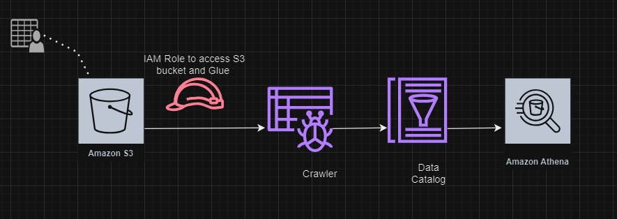

# AWS Glue Crawler Overview

This section dives into AWS Glue Crawlers and Classifiers, essential components for automating data discovery, classification, and cataloging within your data pipelines.

Crawlers act as automated data scouts, exploring and scanning various data sources supported by AWS Glue, including:

1. Amazon S3 buckets (most common)
2. Relational databases (e.g., MySQL, Oracle)
3. Data warehouses (e.g., Redshift)

## Crawler Functionalities:
* *Data Source Discovery:* Crawlers automatically identify data locations within your specified sources.
* *Schema Inference:* During a crawl, the crawler analyzes the data to infer its schema (structure). This includes determining data types for each column and understanding the overall organization.
* *Metadata Generation:* Based on the inferred schema and details like location and format, the crawler generates metadata entries within the AWS Glue Data Catalog. This central registry acts as a catalog for your data assets, simplifying discovery and management.
* *Schema Evolution Handling:* Crawlers can be configured to adapt to evolving data formats. If your data structure changes (e.g., adding new columns), the crawler detects these changes and updates the corresponding metadata in the Data Catalog.
* *Scheduling:* Crawlers can be run on demand or scheduled to run periodically (e.g., daily, weekly) to ensure the Data Catalog stays up-to-date with changes in your data sources.

## Role of Classifiers:
Classifiers work alongside crawlers to accurately understand the format of your data:
* *Data Format Detectives:* Classifiers are sets of rules or patterns that the crawler uses to identify the format of the data it encounters. AWS Glue provides built-in classifiers for common formats like CSV, JSON, Avro, and Parquet. You can also define custom classifiers for less common formats or specific needs.
* *Classifier Workflow:* When a crawler scans a data source, it invokes its associated classifiers in a predefined order:
	1. Crawlers first try built-in classifiers to recognize the format.
	2. If no built-in classifier provides a confident match, the crawler attempts any custom classifiers defined for that source.

## Supported Data Stores for AWS Glue Crawlers
| Connection Method  | Data stores     | 
| :-------- | :------- | 
| Native client | Amazon Simple Storage Service (Amazon S3)
|                      | Amazon DynamoDB |  
| JDBC | Amazon Redshift |
|           | Snowflake |  
|           | Amazon Aurora |  
|           | Maria DB |  
|           | Microsoft SQL Server |  
|           | MySQL | 
|           | Oracle |  
|           | PostgreSQL |
| MongoDB Client          | MongoDB |
|           | MongoDB Atlas|
|           | Amazon DocumentDB |

## Workflow of a Crawler:

   

    
  

## Creating a Crawler - Hands On
			
			
			
				

  
