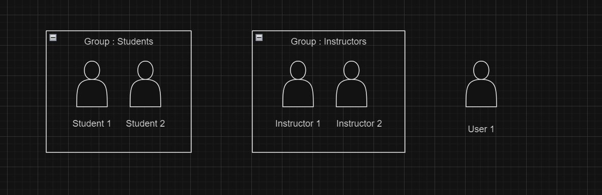
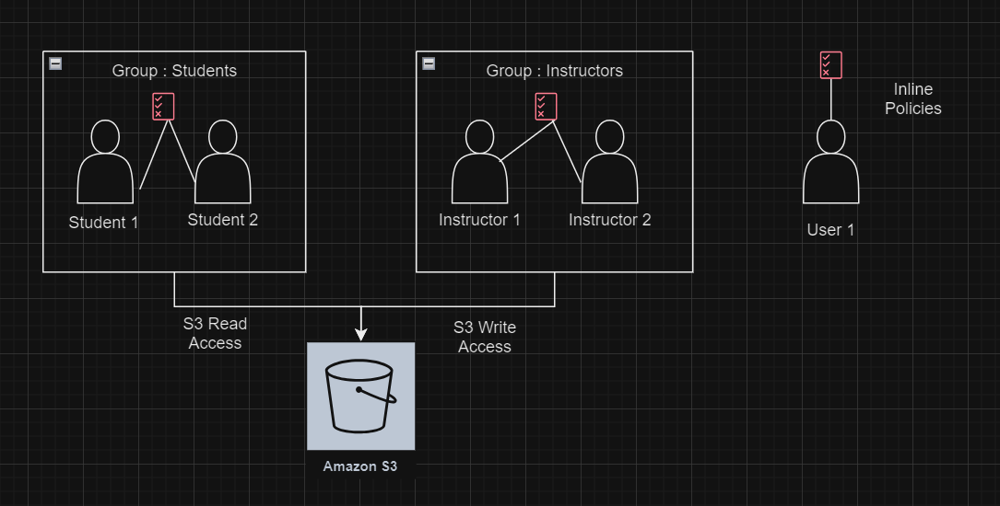
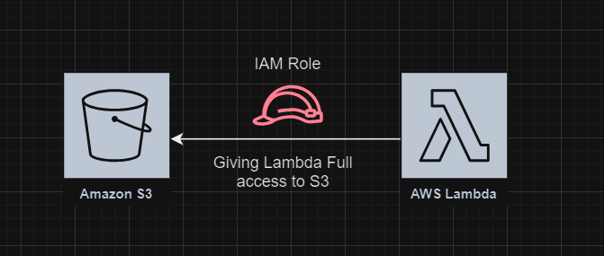
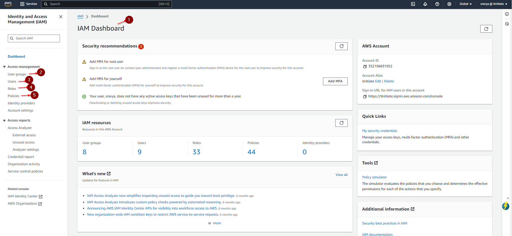

# AWS Identity and Access Management

## Overview
* IAM - Identity and Access Management, Global service - controls access to AWS and its resources.
* Enables you to manage access to AWS services and resources securely. 
* Using IAM, you can create and manage AWS users and groups, and use permissions to allow and deny their access to AWS resources.

In essence, IAM helps you control who can access what within your AWS cloud environment, ensuring security and compliance.

## IAM Core Components

### 1. IAM Users
- **Description**: An IAM user is a resource in IAM that has associated credentials and permissions. An IAM user can represent a person or an application that uses its credentials to make AWS requests. 
- **Common Uses**:
  - Accessing AWS Management Console.
  - Interacting with AWS services programmatically via the API.
    
### 2. IAM User Groups
- **Description**: An IAM group is an identity that specifies a collection of IAM users. You can use groups to specify permissions for multiple users at a time. Groups make permissions easier to manage for large sets of users.
- **Common Uses**:
  - Simplifying permission management for multiple users.
  - Organizing users by department or role (e.g., students group, instructors group).

<p align="center">
  
</p>

#### IAM Permissions
- **Description**: Defines what actions are allowed or denied on users, user groups and aws resources.
- **Common Uses**:
  - Restricting access to specific AWS services or functionalities (e.g., allowing read-only access to an S3 bucket).
  - Controlling the level of access a user or service has (e.g., granting full access vs. read-only access).

### 3. IAM Policies
- **Description**: JSON Documents that define permissions and can be attached to users, groups, roles, or even resources.
- **Common Uses**:
  - Specifying allowed or denied actions and the conditions under which actions are allowed for a user, group, role, or resource.
  - Managing permissions centrally through policy documents which helps in achieving consistent security posture across resources.

<p align="center">
  
</p>

Before proceeding with hands on, let's get an quick understanding on 

#### What is an S3 Bucket? 

* An S3 bucket is a virtual container within AWS Simple Storage Service (S3) designed to store and manage any amount of data.
    -  S3 Bucket: A bucket is like a folder on a cloud platform where you can store any number of files.
    -  S3 Object: An object is a file stored in an S3 bucket.
    -  S3 Key: A key is the unique address that identifies the location and name of a file within a bucket.
* Sample Bucket path :
  
  ```text
  s3://myphotos/2021/trip1/photo.jpg
  ```
* In this example:
  - Bucket: myphotos - This is the name of the S3 bucket where the data is stored.
  - Key: 2021/trip1/photo.jpg - This is the unique identifier for the object within the bucket, which includes the path and the file name.
  - Object: The file itself, in this case, photo.jpg, is the object. It's stored at the specified key within the bucket.

### Hands-On: Managing Users and User Groups in AWS
As depicted in the preceding image, we will create two user groups in the AWS Console: "Students" and "Instructors," with "Student 1" and "Instructor 1" as the initial users.
1. Assign the "Students" group read-only access to the S3 bucket.
2. Assign the "Instructors" group full access to the S3 bucket, allowing them to upload, delete, and view files.
3. Create the user "Student01" and add them to the "Students" group. This user will only have read access to the S3 bucket.
4. Create the user "Instructor01" and add them to the "Instructors" group, granting them full access to the S3 bucket.
   
Instructors can upload, delete, and modify files, as well as create buckets. Students can only download files from the S3 bucket uploaded by instructors and cannot create buckets.

### Hands-On: student1 Inline Policy
We also can attach policies using the inline policies through JSON (Visual Editor)

A sample JSON file for the student01 to access S3 bucket list

```json
{
    "Version": "2012-10-17",
    "Statement": [
        {
            "Sid": "VisualEditor0",
            "Effect": "Allow",
            "Principal": {"AWS": "arn:aws:iam::account-id:user/student01"},
            "Action": [
                "s3:List*"
            ],
            "Resource": "*"
        }
    ]
}
```
Sample Policy Structure in JSON Document:
1. **Version** - Specifies the policy language version, which must always be set to "2012-10-17".
2. **Statements** - This section contains one or more distinct entries:
   * "Sid" :An optional identifier for the statement.
   * "Effect" : Specifies whether the statement allows or denies access.
   * "Principal" : Identifies the account, user, or role to which the policy applies.
   * "Action" :  Defines a list of actions that the policy allows or denies.
   * "Resource" : Enumerates the resources to which the actions are applicable.

#### NOTE: Login with the user credentials that have been provided to Students by the Instructor. [Student Login](aws-login.md)


### 4. IAM Roles
- **Description**:
  * IAM roles are used to grant specific permissions to AWS services, applications, and for cross-account access without using permanent credentials.
  * Roles are assumed temporarily, and when assumed, AWS provides security credentials that are temporary and are automatically rotated.
- **Common Uses**:
  - Granting permissions to AWS services like Lambda functions to interact with other AWS resources without needing a separate IAM user.
  - Allowing users from another AWS account to access specific resources in your account in a secure way.

<p align="center">
  
</p>
  
All the IAM Core components can be accessed from IAM dashboard as shown below.

<p align="center">
  
</p>

## Additional Features
### Multi-Factor Authentication (MFA)
- **Description**: Adds an extra layer of security by requiring a second form of authentication for users
- **Common Uses**:
  - Enhancing security for accessing the AWS console.
  - Protecting sensitive transactions.

## IAM Best Practices
* Enforcing Strong Password Policies - Implement requirements for password complexity and rotation to enhance security.
* Principle of Least Privilege - Ensure that IAM policies grant the minimum permissions necessary to perform job functions.
* Regular Audits - Conduct regular audits of your IAM settings to ensure they meet your current business needs and comply with your security policies.

## Other Ways to access AWS 
* Access AWS via CLI (Command Line Interface): The AWS CLI can be installed on your local PC to interact directly with AWS services. This tool does not require Putty; instead, it uses your IAM user’s access key ID and secret access key for authentication. Once configured, you can manage AWS resources from your command line.
* Steps to access AWS via a CLI (Command Line Interface)
  - Step 1: Download the installer for CLI in your PC Refer https://aws.amazon.com/cli/
  - Step 2: Install the AWS CLI, once downloaded following the prompts given on the screen.
  - Step 3: Configure AWS CLI
         1. Open Command Prompt, type 'aws configure'
         2.  You will be prompted to enter your AWS Access Key ID and AWS Secret Access Key, which you can get from your AWS Management Console under IAM (Identity and Access Management).
         3. Next, enter the default region name (e.g., us-east-1) and default output format (e.g., json). These settings can be changed later if needed.
  - Step 4: Verify Installation
    ```text
    aws s3 ls
    ```
    This command lists all the S3 buckets available under your account. If the configuration is correct, you should see a list of your S3 buckets (if any exist).
  - Step 4: Using AWS CLI:
    You can now use the AWS CLI to manage your AWS services. For example, to launch an EC2 instance, manage IAM roles, or handle other AWS resources.
    Each AWS service has specific CLI commands. You can find these by typing aws [service] help in the Command Prompt.

* Using AWS CloudShell: AWS CloudShell is a browser-based shell that you can launch directly from the AWS Management Console. It provides command-line access to AWS resources without the need to install any local software. CloudShell is pre-authenticated with your console credentials, simplifying the process of running AWS CLI commands directly in your browser.


## TASK 

Try creating S3 bucket using Command Line Interface. 
