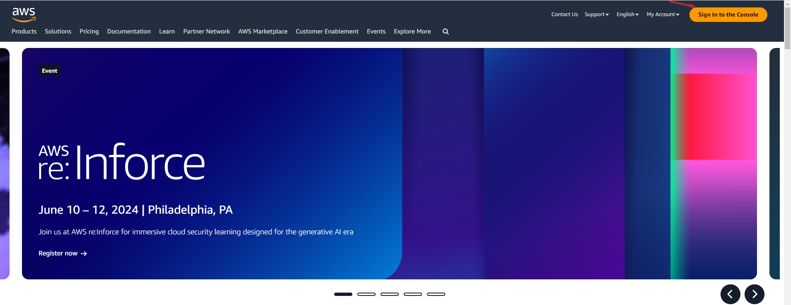
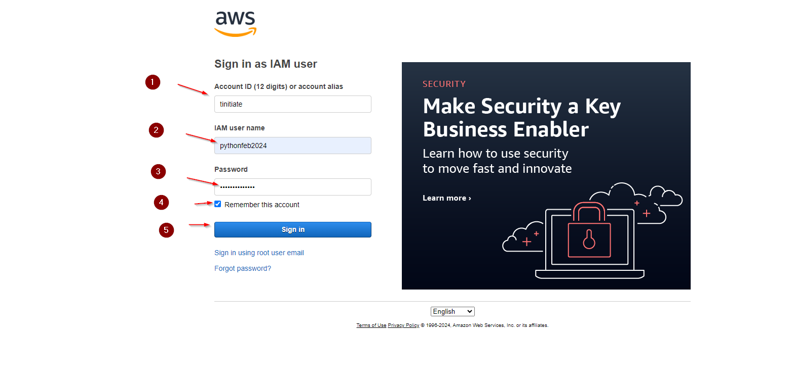
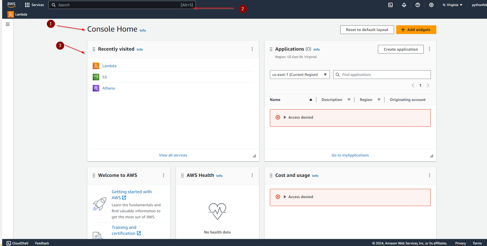
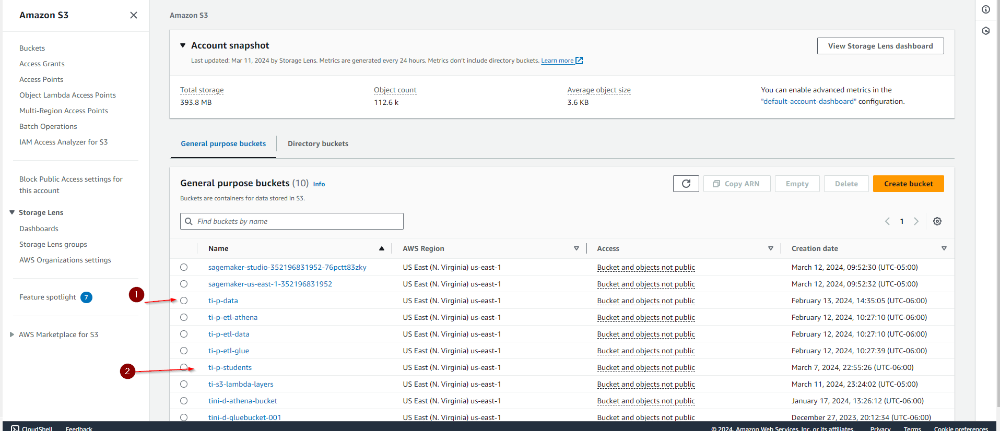

# Welcome to AWS Training

1. 	Navigate to the C drive on your computer, create a new folder named 'aws', and download the 'tinitiate.zip' file into this folder.
2. 	Extract the zip file's contents into a subfolder named 'aws'.
3. 	The 'aws' folder contains has 2 files 
    File 1: 'Config' - has Student profile details
    File 2: 'credentials' - has access ID and access key
    File 3: 'User Name and Password' - login credentials into AWS Console.
4. isit https://aws.amazon.com/ and click on 'Sign In to the console' to access your AWS account.
  

  

5. Please select the credentials as below
     1. Account Id: tinitiate
     2. Iam Username: Please enter the username given in file
     3. Password: Please enter the password given in file
     4. Click on Remember the account
     5. Click Sign in

  

6. After logging in, you will be directed to the Console Home.
- Console Home: This is the first page you will see once logged in.
- Search Bar: Use this feature to type in and search for specific pages or services within AWS.
- Recently Visited: This section displays the AWS services you have accessed recently.

  

7. S3:: Click on S3 bucket 

It will take you to Amazon S3 Bucket
1.	ti-student-apr-2024: this is an s3 bucket where students can add, delete, and modify the files.

  

