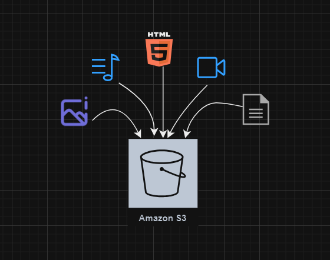
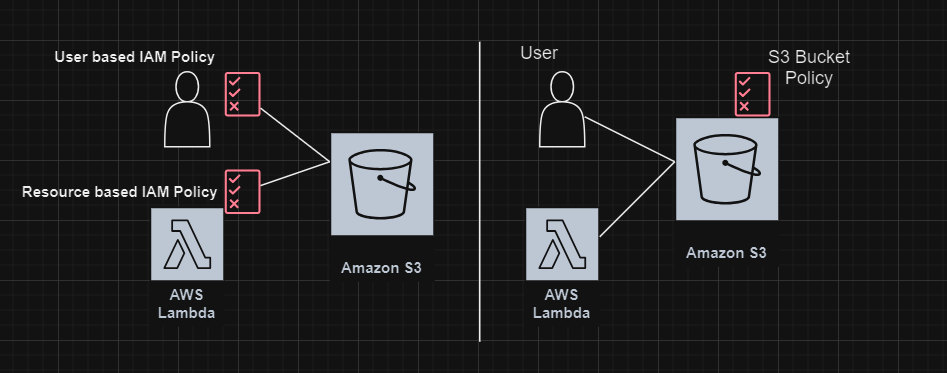

# Amazon S3 (Simple Storage Service)
Amazon Simple Storage Service (S3) is a cloud-based object storage service that allows users to store and retrieve any amount of data from anywhere at any time.

<p align="center">
  
</p>

## S3 Features
- **Scalability:** S3 can handle vast amounts of data and scale up or down as required by user demands, supporting both small businesses and large enterprises.
- **Data Availability:** Ensures high data availability, making it reliable for mission-critical applications.
- **Security:** Offers comprehensive security features that protect data both at rest and in transit.
- **Performance:** Delivers superior performance necessary for high-speed data access and throughput.
- **Versatility:** Suitable for a wide range of use cases, from website hosting to backup and recovery, providing flexible solutions for data storage.

## S3 Usecases
- **Backup and Restore:** Use S3 to securely save copies of your data. If you lose your original data, you can quickly get it back from S3.
- **Disaster Recovery:** S3 helps keep your data safe by storing it in multiple locations across the globe. This way, if one location has a problem, your data is still safe in another location.
- **Archiving:** Store your old, rarely needed data in S3 to comply with laws or company policies that require keeping records for a long time.
- **Application Hosting:** Use S3 to store and deliver website content, especially for websites that don't change dynamically. It's great for hosting images, videos, and other files that your website uses.
- **Data Lakes and Big Data Analytics:** S3 can store huge amounts of data from various sources, making it perfect for big data projects. You can analyze this data to uncover trends and make better decisions.

## S3 Buckets
- **Description**: A bucket is a logical container in S3 where you store data (objects).
- **Naming Conventions**:
  - Must be unique across all of AWS (i.e name must be globally unique)
  - Created at the Region Level
  - Can be between 3 and 63 characters long.
  - Can contain lowercase letters, numbers, hyphens (-), and periods (.).

## S3 Objects
- **Description**: The fundamental entities stored in S3, which consist of data and metadata. Where as the "KEY" is the full path to an S3 bucket.
- **Details**:
  - Each object is identified by a unique key within a bucket.
  - Can range in size from a few bytes to 5TB (5000GB).
  - If uploading more than 5TB, than we must use multi-part-upload.

### Sample Bucket path :
  ```text
          s3://myphotos/2021/trip1/photo.jpg
  ```
  In this example:
  
  - Bucket: 'myphotos' - This is the name of the S3 bucket where the data is stored.
  - Key: '2021/trip1/photo.jpg' - This is the unique identifier for the object within the bucket, which includes the path and the file name.
  - Object: The file itself, in this case, photo.jpg, is the object. It's stored at the specified key within the bucket.

### Hands On : Creating and Configuring an S3 Bucket for the Student1 user.

## Bucket Policies : 

<p align="center">
  
</p>

Up to this point, we've explored methods to grant access to a user through IAM User Policies and allow other AWS resources access to S3 via IAM roles. Additionally, beyond using IAM User Policies and Roles, we can also establish a bucket policy to control access at the bucket level.

- **Description**: JSON-based policies used to grant or restrict permissions for an S3 bucket and the objects within it.
- **Example**: Allowing public read access to a bucket:
  ```json
  {
      "Version": "2012-10-17",
      "Id": "Policy1717533515994",
      "Statement": [
          {
              "Sid": "Stmt1717533514621",
              "Effect": "Allow",
              "Principal": {
                  "AWS": "arn:aws:iam::352196831952:user/student1"
              },
              "Action": "s3:PutObject",
              "Resource": "arn:aws:s3:::testbucket/*"
          }
      ]
  }
  ```
- Explanation of the policy structure:
  * Resources : to which buckets and objects we applying this policy for
  * Effect : Allow/Deny
  * Actions : Set of API to allow or deny
  * Principal : Account or user to apply the policy to.
  
### Hands on : Writing and Applying a Bucket Policy
 
## Bucket Versioning
- **Description**: Keeps multiple versions of an object in the same bucket.
- **Uses:**
  - Protects against accidental deletions and overwrites.
  - Enables easy recovery of previous versions of objects.

## S3 Security
- **Access Control**: Managed through IAM policies, bucket policies, and access control lists (ACLs).
- **Encryption**:
  - **Server-Side Encryption (SSE)**: Encrypts data at rest.
  - **Client-Side Encryption**: Data is encrypted before sending to S3.

## Storage Classes
Amazon S3 offers different storage classes for cost-efficient storage of your data:

- S3 Standard: General-purpose storage for frequently accessed data.
- S3 Intelligent-Tiering: Optimizes costs by automatically moving data to the most cost-effective access tier.
- S3 Standard-IA (Infrequent Access): For data that is accessed less frequently but requires rapid access when needed.
- S3 One Zone-IA: Lower-cost option for infrequently accessed data that doesn't require multiple availability zone resilience.
- S3 Glacier: Low-cost storage for archival data with retrieval times ranging from minutes to hours.
- S3 Glacier Deep Archive: Lowest-cost storage for data that is rarely accessed, with retrieval times of 12 hours or more.
