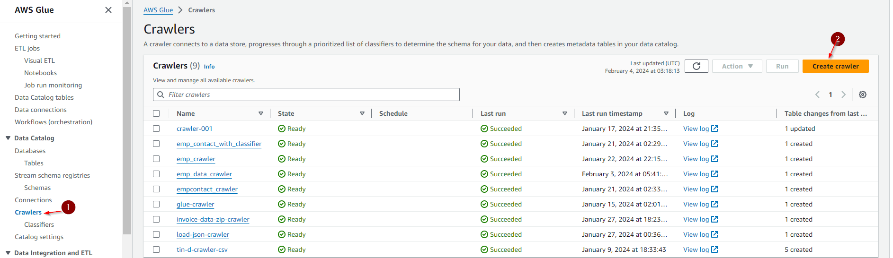
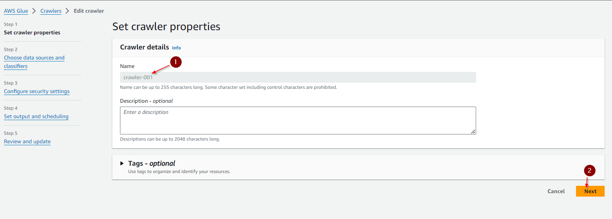
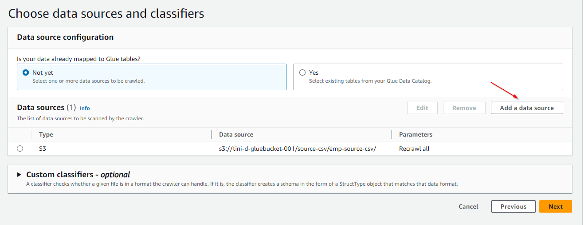
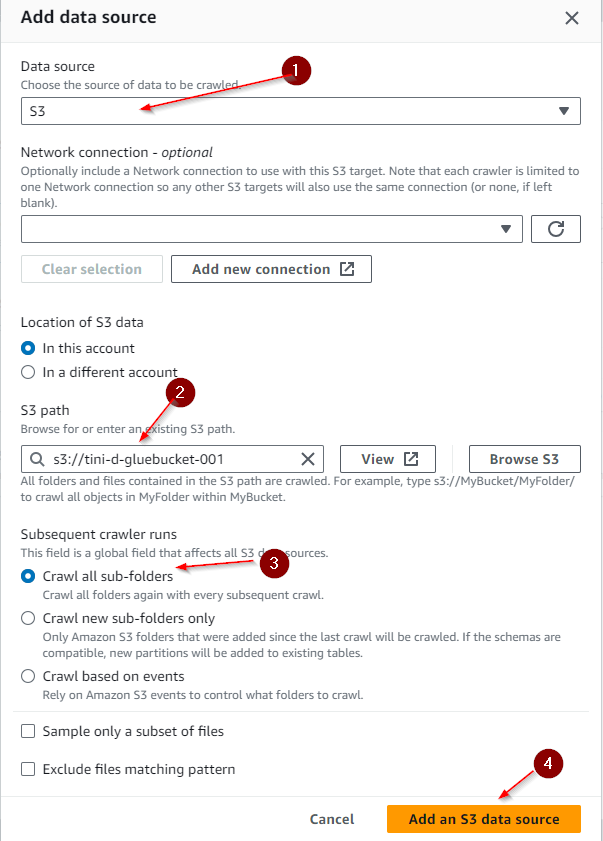
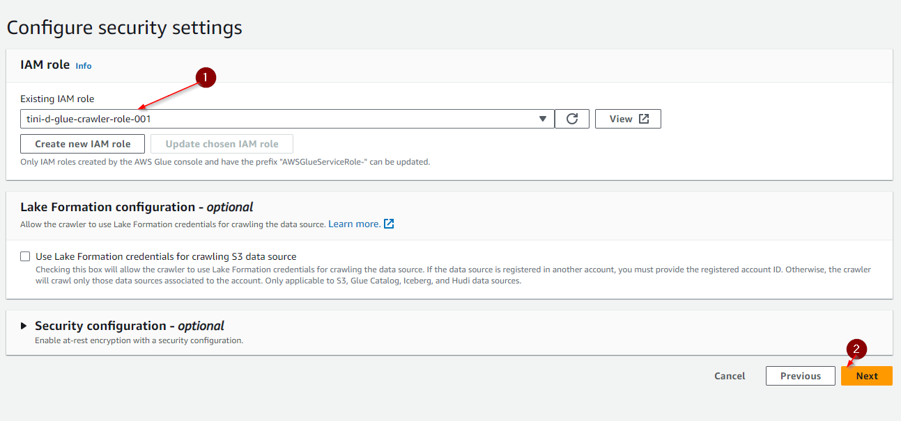
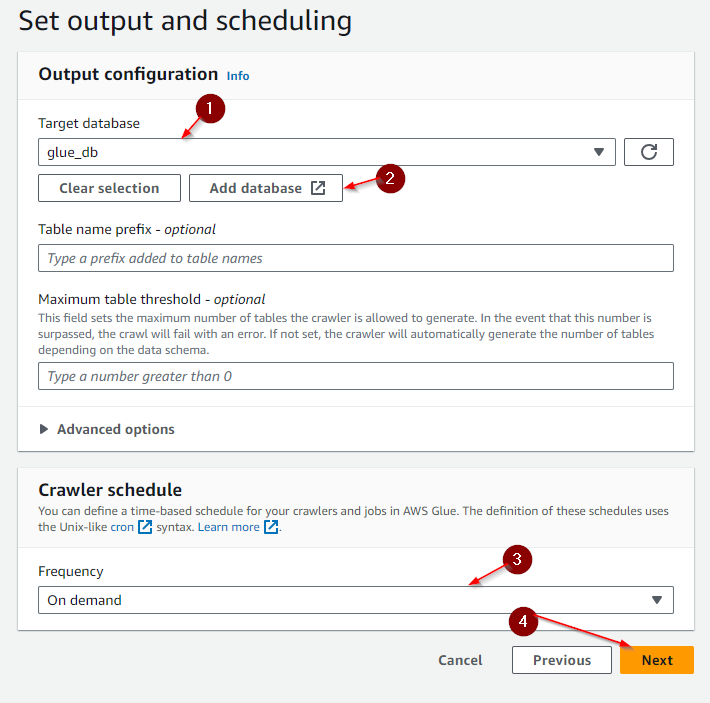
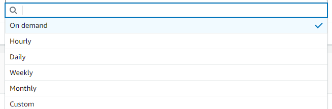
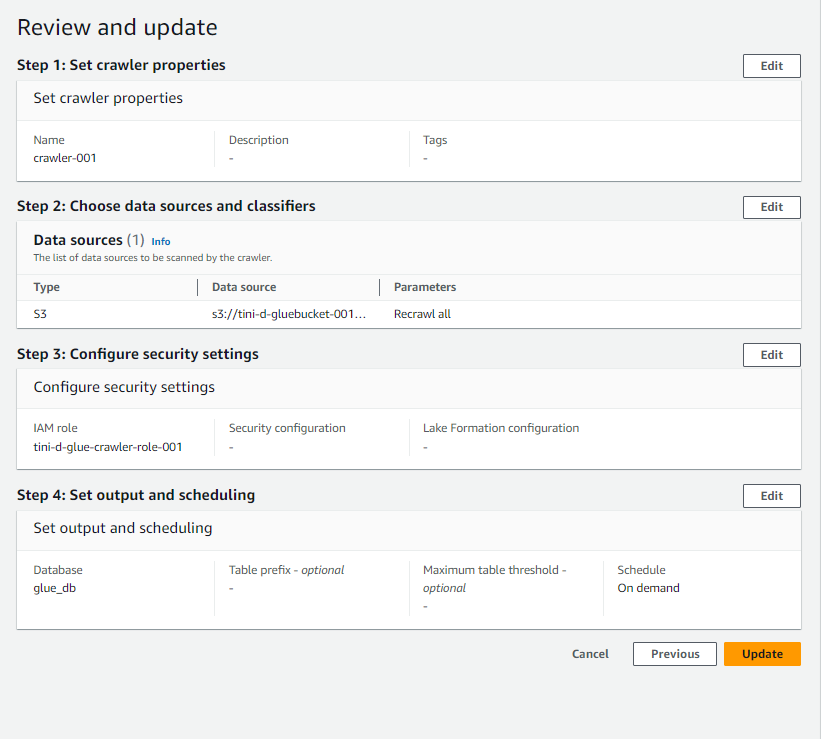
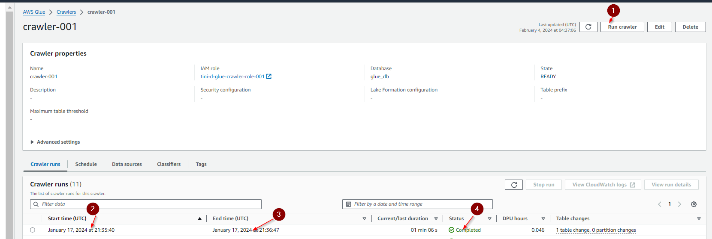

# Creating AWS Glue Crawlers

### Step 1: 
Go to AWS Glue, click the crawlers tab on the left side of the page ,click create crawler.
   1. Click Crawler tab
   2. Click Create Crawler
      
   
 
### Step 2: 
Set Crawler properties
   1. Name : Enter Unique Name for the Crawler
   2. Click Next
      
      

### Step 3:
Choose the data source and classifiers,Data source configuration , Add a data source.
   1. Select S3 as a Data Source
   2. Select S3 bucket path
   3. crawl all the folders(it will crawl all subfolder, you choose according to your requirement)
   4. Add a Data Source

   
  
   
 
### Step 4:
Configure Security Setting
   1. Choose the existing IAM role for crawler
   2. Click Next
      
      

### Step 5:
* Set Output and Scheduling
   1. Select the Target Database, we have already created glue_db . ( Create a database in database, if you want to add in a new database )
   2. If Database is not created then click Add Database to create one.
   3. select the frequency on which the crawler to run. 
   4. Click next
      
      

* Crawler Schedule, you can select the crawler schedule  
    on how to run it, below you can choose anyone.
  
     
     
* Once you select scheduler, then click next and review 
   the full setting before clicking finish. It will create a crawler to move the data from S3 to Data 	 
   Catalog
  
     

* Once the Crawler is created, please select Run Crawler and once it is completed it will display as below.
  1. Click Crawler.
  2. Start time , this will display the start time for the  
      crawler.
  3. End time, this will display the end time for the crawler.
  4. Status , this will display the status of the crawler job.
  
   

* Crawler S3
    * `Source` CSV `Target` CSV
    * `Source` JSON `Target` JSON
    * `Source` Parquet `Target` Parquet
    * `Source` ION `Target` ION
        * New File [Do this with AWS Lambda]
        * Add Rows [Do this with AWS Lambda]
        * Remove Rows [Do this with AWS Lambda]
           
* Crawler DB
    * Crawler On single tables
    * Crawler On PK-FK tables
    * Crawler On View
* Crawler Dynamo
* Crawler Metrics (Stats like DB Tables, last crawled datetime, PCT scanned, Pending time for Crawl)
* Crawler performance tuning

